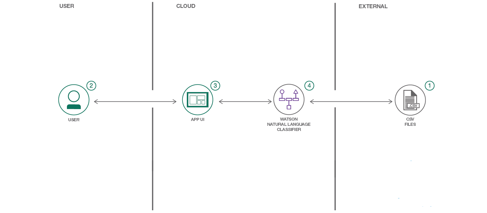
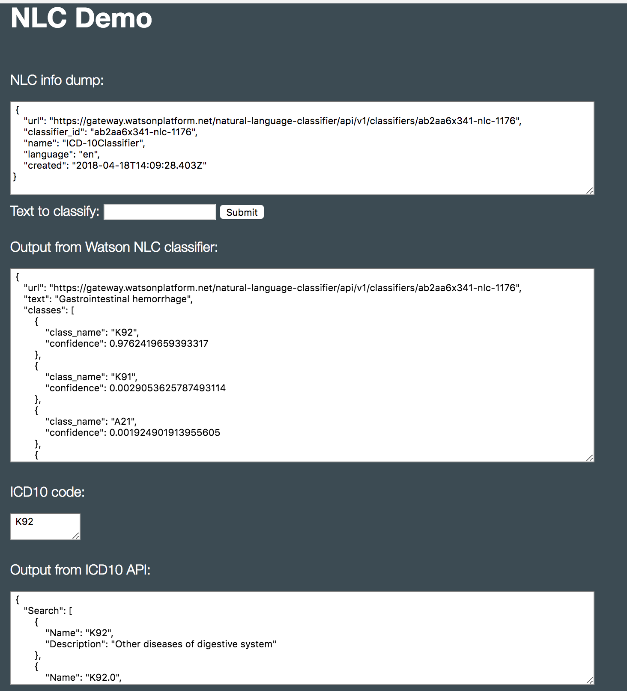

> **DISCLAIMER**: This application is used for demonstrative and illustrative purposes only and does not constitute an offering that has gone through regulatory review. It is not intended to serve as a medical application. There is no representation as to the accuracy of the output of this application and it is presented without warranty.

# Classify medical diagnosis with ICD-10 code

This application was built to demonstrate IBM's Watson Natural Language Classifier (NLC). The data set we will be using, [ICD-10-GT-AA.csv](data/ICD-10-GT-AA.csv), contains a subset of [ICD-10](https://en.wikipedia.org/wiki/ICD-10) entries. ICD-10 is the 10th revision of the International Statistical Classification of Diseases and Related Health Problems. In short, it is a medical classification list by the World Health Organization (WHO) that contains codes for: diseases, signs and symptoms, abnormal findings, complaints, social circumstances, and external causes of injury or diseases. Hospitals and insurance companies alike could save time and money by leveraging Watson to properly tag the most accurate ICD-10 codes.

This application is a Python web application based on the [Flask microframework](http://flask.pocoo.org/), and based on earlier work done by [Ryan Anderson](https://github.com/rustyoldrake/IBM_Watson_NLC_ICD10_Health_Codes). It uses the [Watson Python SDK](https://github.com/watson-developer-cloud/python-sdk) to create the classifier, list classifiers, and classify the input text. We also make use of the freely available [ICD-10 API](http://icd10api.com/) which, given an ICD-10 code, returns a name and description.

When the reader has completed this pattern, they will understand how to:

* Create a Natural Language Classifier (NLC) service and use it in a Python application.
* Train a NLC model using csv data.
* Deploy a web app with Flask to allow the NLC model to be queried.
* Quickly get a classification of a disease or health issue using the Natural Language Classifier trained model.

## Flow

1. CSV files are sent to the Natural Language Classifier service to train the model.
2. The user interacts with the web app UI running either locally or in the cloud.
3. The application sends the user's input to the Natural Language Classifier model to be classified.
4. The information containing the classification is returned to the web app.



## Included Components

* [Watson Natural Language Classifier](https://www.ibm.com/watson/services/natural-language-classifier/)An IBM Cloud service to interpret and classify natural language with confidence.

## Featured Technologies

* [Artificial Intelligence](https://medium.com/ibm-data-science-experience): Artificial intelligence can be applied to disparate solution spaces to deliver disruptive technologies.
* [Cloud](https://www.ibm.com/developerworks/learn/cloud/): Accessing computer and information technology resources through the Internet.
* [Python](https://www.python.org/): Python is a programming language that lets you work more quickly and integrate your systems more effectively.

# Watch the Video

[](https://www.youtube.com/watch?v=N0eKEZxdwsQ)

## Prerequisites

Here we create the classifier with our ICD-10 dataset.

1. Clone this project: `git clone git@github.com:IBM/nlc-icd10-classifier.git` and `cd` into the new directory.

1. We'll be using `ICD-10-GT-AA.csv` dataset in the `data` folder
    > Note that this is a subset of the entire ICD-10 classification set, which allows faster training time

1. Create an [NLC service in IBM Cloud](https://console.bluemix.net/catalog/services/natural-language-classifier), make a note of the service name used in the catalog, we'll need this later.

1. Create service credentials by using the menu on the left and selecting the default options.
    

1. Export the username and password as environment variables and then load the data using the command below. This will take around 3 hours.

    ```bash
    export USERNAME=<username_from_credentials>
    export PASSWORD=<pasword_from_credentials>
    export FILE=data/ICD-10-GT-AA.csv

    curl -i --user "$USERNAME":"$PASSWORD" -F training_data=@$FILE -F training_metadata="{\"language\":\"en\",\"name\":\"ICD-10Classifier\"}" "https://gateway.watsonplatform.net/natural-language-classifier/api/v1/classifiers"
    ```

1. After running the command to create the classifier, note the `classifier_id` in the json that is returned:

    ```JSON
    {
      "classifier_id" : "ab2aa6x341-nlc-1176",
      "name" : "ICD-10Classifier",
      "language" : "en",
      "created" : "2018-04-18T14:09:28.403Z",
      "url" : "https://gateway.watsonplatform.net/natural-language-classifier/api/v1/classifiers/ab2aa6x341-nlc-1176",
      "status" : "Training",
      "status_description" : "The classifier instance is in its training phase, not yet ready to accept classify requests"
    }
    ```

    and export that as an environment variable:

    ```bash
    export CLASSIFIER_ID=<my_classifier_id>
    ```

    Now you can check the status for training your classifier:

    ```bash
    curl --user "$USERNAME":"$PASSWORD" "https://gateway.watsonplatform.net/natural-language-classifier/api/v1/classifiers/$CLASSIFIER_ID"
    ```

## Steps

This application can be run locally or hosted on IBM Cloud, follow the steps below depending on your deployment choice

### Run locally

1. Clone this project: `git clone git@github.com:IBM/nlc-icd10-classifier.git`

1. `cd` into this project's root directory

1. (Optionally) create a virtual environment: `virtualenv my-nlc-classifier`
    1. Activate the virtual environment: `. my-nlc-classifier/bin/activate`

1. Run `pip install -r requirements.txt` to install the app's dependencies

1. Copy the `env.example` file to `.env`

1. Update the `.env` file  with your NLC credentials:

    ```bash
    # Replace the credentials here with your own.
    # Rename this file to .env before running run.py.

    NATURAL_LANGUAGE_CLASSIFIER_USERNAME=<add_NLC_username>
    NATURAL_LANGUAGE_CLASSIFIER_PASSWORD=<add_NLC_password>
    ```

1. Run `python welcome.py`

1. Access the running app in a browser at `http://localhost:5000`

### Run on IBM Cloud

1. Clone this project: `git clone git@github.com:IBM/nlc-icd10-classifier.git`

1. `cd` into this project's root directory

1. Update [`manifest.yml`](manifest.yml) with the NLC service name (`your_nlc_service_name`), a unique application name (`your_app_name`) and unique host value (`your_app_host`)


    ```yaml
    applications:
      - path: .
      memory: 256M
      instances: 1
      domain: mybluemix.net
      name: your_app_name
      host: your_app_host
      disk_quota: 1024M
      services:
      - your_nlc_service_name
      buildpack: python_buildpack
    ```

1. Run `bluemix app push` from the root directory

1. Access the running app by going to: `https://<host-value>.mybluemix.net/`

    > If you've never run the `bluemix` command before there is some configuration required, refer to the official [IBM Cloud CLI](https://console.bluemix.net/docs/cli/reference/bluemix_cli/get_started.html) docs to get this set up.

# Sample Output

The user inputs information into the `Text to classify:` box and the Watson NLC classifier will return ICD10 classifications with confidence scores.
Here is the output for the input `Gastrointestinal hemorrhage`:



# Links
* [Watson NLC API](https://www.ibm.com/watson/developercloud/natural-language-classifier/api/v1/)
* [Watson Python SDK](https://github.com/watson-developer-cloud/python-sdk)
* [IBM Cloud CLI](https://console.bluemix.net/docs/cli/reference/bluemix_cli/get_started.html)
* [Watson Natural Language Classifier](https://www.ibm.com/watson/services/natural-language-classifier/)
* [Ryan Anderson's Original Work](https://github.com/rustyoldrake/IBM_Watson_NLC_ICD10_Health_Codes)
* [ICD-10 API](http://icd10api.com)
* [ICD-10 on Wikipedia](https://en.wikipedia.org/wiki/ICD-10)
* [Intro to NLC Tutorial](https://www.youtube.com/watch?v=SUj826ybCdU)

# Learn more

* **Artificial Intelligence Code Patterns**: Enjoyed this Code Pattern? Check out our other [AI Code Patterns](https://developer.ibm.com/code/technologies/artificial-intelligence/).
* **AI and Data Code Pattern Playlist**: Bookmark our [playlist](https://www.youtube.com/playlist?list=PLzUbsvIyrNfknNewObx5N7uGZ5FKH0Fde) with all of our Code Pattern videos
* **With Watson**: Want to take your Watson app to the next level? Looking to utilize Watson Brand assets? [Join the With Watson program](https://www.ibm.com/watson/with-watson/) to leverage exclusive brand, marketing, and tech resources to amplify and accelerate your Watson embedded commercial solution.

# License

[Apache 2.0](LICENSE)
